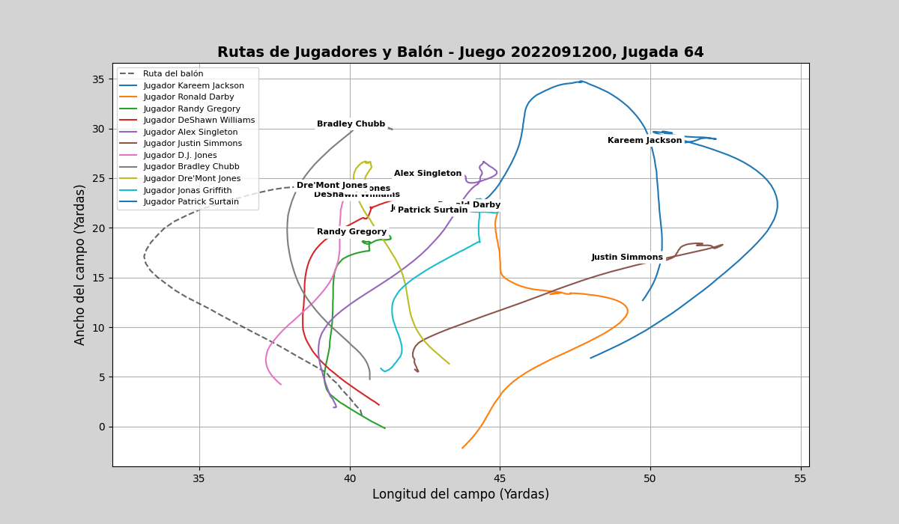
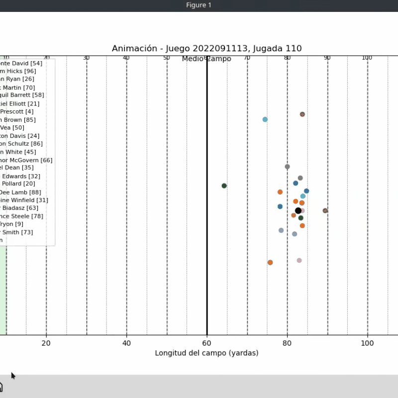

# 🏈 **Football Tracking Visualization** 🏈

Este proyecto está diseñado para visualizar datos de seguimiento de jugadores en partidos de fútbol, utilizando técnicas de visualización de datos avanzadas. A través de este repositorio, podrás explorar cómo los datos de posición y movimientos de los jugadores pueden ser utilizados para entender mejor el juego y las estrategias en tiempo real.

## 🚀 **Características**
- Visualización interactiva de las posiciones de los jugadores durante las jugadas.
- Representación de estadísticas clave como la velocidad, distancia recorrida y más.
- Análisis en tiempo real de las jugadas y comportamientos tácticos.
- Compatible con los conjuntos de datos de la NFL, incluido el seguimiento de jugadas y jugadores.

## 📊 **Tecnologías Utilizadas**
- **Python**: Para el procesamiento de datos y la creación de visualizaciones.
- **Matplotlib / Seaborn / Plotly**: Bibliotecas para visualización de datos.
- **Pandas**: Para el análisis y manipulación de datos.
- **Jupyter Notebooks**: Para crear análisis interactivos.

## 💻 **Instalación**
1. Clona el repositorio:
   ```bash
   git clone https://github.com/Sir-Winlix/Football-Tracking-Visualization.git
Instala las dependencias necesarias:

pip install -r requirements.txt

Abre el proyecto en Jupyter Notebook o ejecuta los scripts directamente:

    jupyter notebook

## 📸 **Ejemplo de Funcionamiento**
Aquí puedes ver cómo funciona la visualización:



Y una animación que muestra el movimiento de los jugadores durante una jugada:



Este proyecto está bajo la licencia MIT. Consulta el archivo LICENSE para más detalles.
