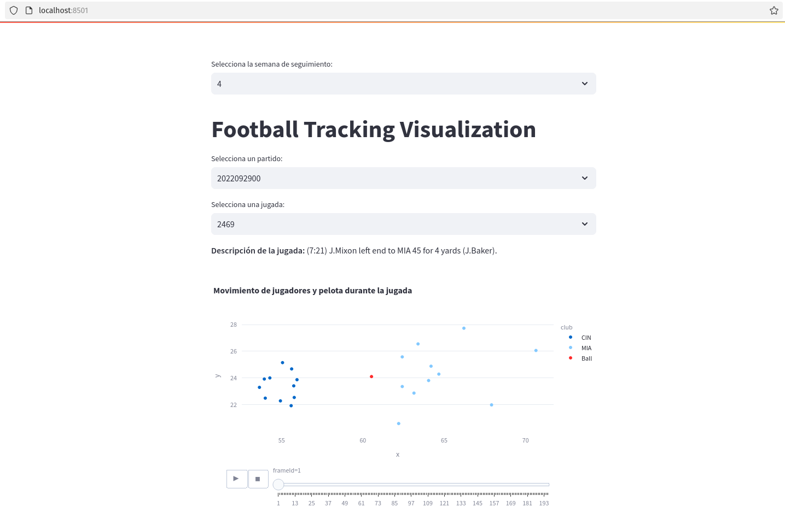

# 🏈 **Football Tracking Visualization** ⚡

**Football Tracking Visualization** es una aplicación interactiva construida con **Streamlit** que te permite visualizar y analizar el movimiento de los jugadores y la pelota durante los partidos de la NFL 🏆, usando datos de seguimiento de jugadas de la temporada 📊.

## 🚀 Funcionalidades Principales

1. **Selección de Semana y Partido** 📅
   - Elige entre varias semanas de seguimiento (del 1 al 9) para explorar los partidos y jugadas de cada semana de la temporada 🏈.
   - ¡Selecciona un partido y comienza a explorar!

2. **Visualización de Jugadas** 🎮
   - Al elegir un partido, podrás seleccionar jugadas específicas para verlas en detalle 🎯.
   - La **descripción de la jugada** se muestra para que puedas entender qué ocurrió en el campo.

3. **Seguimiento de Jugadores y Pelota** 🎥
   - Visualiza el **movimiento de los jugadores** en el campo en cada fotograma de la jugada 📍.
   - La **pelota** también es visible, con un identificador único para distinguirla de los jugadores 🏈.

4. **Animación Interactiva** 🎬
   - Observa cómo se desarrollan las jugadas fotograma por fotograma, viendo en tiempo real el **movimiento** de los jugadores y la pelota 🏃‍♂️💨.
   - Utilizamos **Plotly** para crear gráficos interactivos y animados 📊✨.

5. **Interactividad y Personalización** 🔍
   - ¡Haz zoom! Desplázate por el campo y observa detalles adicionales al pasar el ratón sobre los jugadores o la pelota 👀.
   - La visualización se ajusta dinámicamente según las jugadas y datos de seguimiento que elijas.

## ⚙️ Tecnologías Utilizadas

- **Streamlit**: Framework de Python para crear aplicaciones web interactivas 🌐.
- **Pandas**: Librería para manipular y analizar datos en Python 🐼.
- **Plotly**: Herramienta para crear gráficos interactivos en Python 📈.
- **CSV**: Archivos de datos que contienen información sobre partidos, jugadas, jugadores y seguimiento de las jugadas 📝.

## 📂 Archivos de Datos

1. **games.csv**: Información sobre los partidos, incluyendo equipos, fechas y puntuaciones 🏆.
2. **plays.csv**: Detalles de las jugadas, como tipo de jugada, cuarto del partido y más 📝.
3. **players.csv**: Datos de los jugadores: nombre, posición, universidad, altura, peso y más ⚡.
4. **player_play.csv**: Información sobre las estadísticas de los jugadores en cada jugada (yardas, intentos, receptores) 🏃‍♂️.
5. **tracking_week_[week].csv**: Datos de seguimiento de las jugadas (posición, velocidad, aceleración de jugadores y pelota) 📍.

## 🏃‍♂️ Cómo Ejecutar el Proyecto

1. **Clonar el repositorio:**

git clone https://github.com/Sir-Winlix/Football-Tracking-Visualization.git cd Football-Tracking-Visualization

2. **Instalar dependencias:**

Asegúrate de tener **Python 3.x** instalado, y luego instala las dependencias con:

pip install -r requirements.txt

3. **Ejecutar la aplicación:**

Una vez instaladas las dependencias, ejecuta la aplicación con el siguiente comando:

streamlit run app.py

4. **Acceder a la aplicación:**

La aplicación estará disponible en tu navegador en `http://localhost:8501` 🌐.

---

¡Disfruta visualizando y explorando las jugadas de la NFL! 🏈⚡ Si tienes preguntas o sugerencias, no dudes en abrir un **issue**.

